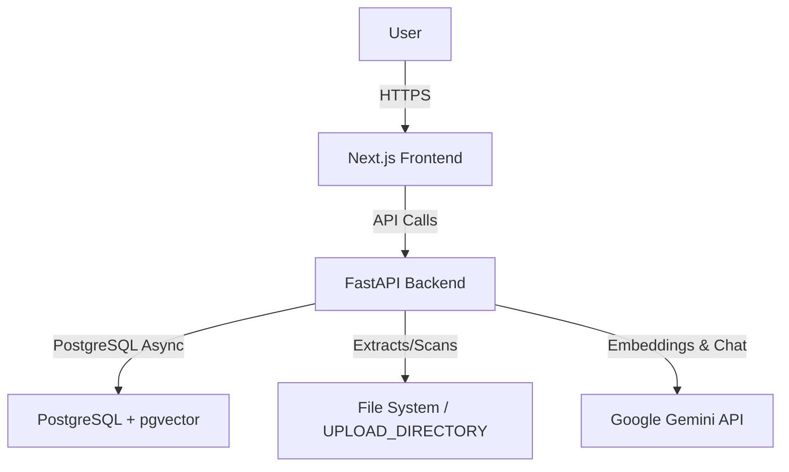

# CodeBase AI

Understand Any Codebase in Minutes. CodeBase AI is a powerful tool designed to ingest a ZIP of a repository or directly from GitHub and allow you to intuitively chat, search, and understand the architecture, database schema, and logic of a project using AI (Gemini).

## Features
- **Semantic Code Search (RAG)**: Uses pgvector and Google's `text-embedding-004` to accurately find and cite exact code snippets relevant to your questions.
- **AI Repository Overview**: Automatically generates an architecture overview and tech stack summary of the repository.
- **GitHub Import**: Directly import public GitHub repositories without manual downloading.
- **File Explorer**: Browse the imported codebase file by file in a structured folder tree.
- **Export**: Export your chat sessions as Markdown or PDF.
- **Global Search**: Command palette (⌘K) to quickly jump between repositories and settings.

## Tech Stack
- **Frontend**: Next.js 15, React 19, Tailwind CSS, Lucide Icons, cmdk.
- **Backend**: FastAPI, SQLAlchemy (Async), PostgreSQL + pgvector, Alembic.
- **AI Models**: Google Gemini 2.5 Flash (Chat) and text-embedding-004 (Embeddings).

## Local Setup

### 1. Requirements
- Node.js >= 18
- Python >= 3.10
- PostgreSQL with `pgvector` extension enabled.

### 2. Database
Run PostgreSQL locally with pgvector (e.g., using Docker):
```bash
docker run --name codebase_db -e POSTGRES_PASSWORD=postgres -p 5432:5432 -d ankane/pgvector
```

### 3. Backend Setup
```bash
cd backend
python3 -m venv venv
source venv/bin/activate
pip install -r requirements.txt

# Create .env based on .env.example
cp .env.example .env

# Run migrations
alembic upgrade head

# Start server
fastapi run app/main.py --port 8000
```

### 4. Frontend Setup
```bash
# In the root folder
npm install

# Create .env.local
echo "NEXT_PUBLIC_API_URL=http://localhost:8000" > .env.local

# Run Next.js
npm run dev
```

## Deployment Guide

### Vercel (Frontend)
1. Push the repository to GitHub.
2. Import the project in Vercel.
3. Set the Root Directory to the project root (default).
4. Set Environment Variables:
   - `NEXT_PUBLIC_API_URL`: The URL of your deployed backend (e.g., `https://codebase-backend.up.railway.app`).
5. Deploy.

### Railway / Render (Backend)
1. Create a new service on Railway or Render using this repository.
2. Set the Root Directory to `/backend`.
3. Set the start command to: `fastapi run app/main.py --port $PORT`
4. Create a Postgres Database with `pgvector` supported (e.g., Neon).
5. Set Environment Variables in Railway/Render:
   - `DATABASE_URL`: Your Postgres connection string.
   - `GEMINI_API_KEY`: Your Google Gemini API Key.
   - `JWT_SECRET`: A secure random string for auth.
   - `CORS_ORIGINS`: Your Vercel frontend URL (e.g., `https://codebase-ai.vercel.app`).
6. Deploy. (Ensure `alembic upgrade head` runs as part of the build or release command).

### Neon (PostgreSQL)
1. Create a project in Neon.
2. Enable pgvector: run `CREATE EXTENSION IF NOT EXISTS vector;` in the Neon SQL Editor.
3. Copy the connection string to `DATABASE_URL` in the backend service.

## Architecture


